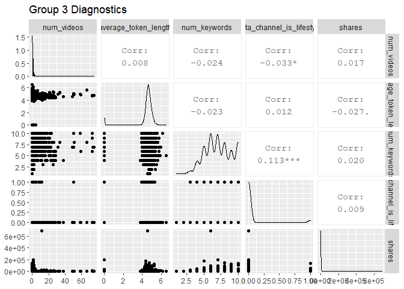

Project 2: Modeling & Report Automation
================
Kelly Baker
10/9/2020

  - [**INTRODUCTION**](#introduction)
  - [**DATA**](#data)
  - [**SUMMARIAZATION**](#summariazation)
  - [**MODELS**](#models)
      - [**Model 1: Regression Tree
        Model**](#model-1-regression-tree-model)
      - [**Model 2: Boosted Tree Model**](#model-2-boosted-tree-model)
  - [**PREDICTION**](#prediction)
  - [**AUTOMATION**](#automation)

# **INTRODUCTION**

In this vignette, we’ll look at various attributes of articles published
by Mashable in an effort to predict popularity. For the popularity, the
response, we’ll use number of social media shares as a proxy. The
predictors, oh which there are nine, were chosen based on their
correlation with the response. The nine independent variables are:  
\* **n\_non\_stop\_words**: rate of unique non-stop words \*
**num\_hrefs**: number of links \* **data\_channel\_is\_world**: is data
channel world? 1=yes, 0=no \* **kw\_avg\_avg**: average keywords,
average shares \* **self\_reference\_min\_shares**: minimum shares of
referenced articles in Mashable \* **self\_reference\_avg\_sharess**:
Average shares of referenced articles in Mashable \* **LDA\_03**:
Closeness to LDA topic 3 \* **global\_subjectivity**: text subjectivity
\* **avg\_negative\_polarity**: average polarity of negative words

# **DATA**

In the code chunk below, I’ve read in my .csv dataset,
OnlineNewsPopularity, via the read\_csv() function, filtering to only
include data on articles that were published on Mondays via the filter()
function, and selecting all variables except for url and timedelta (as
they are non-predictive variables). <br> Next, I’ve split my data into
two parts: a training set and a test set using helpful function from the
`caret` package. With the createDataPartion() function, I’ve indexed 70%
of the data which I was then able to call and save into a training
dataset (train\_news). The remaining 30% of data was saved as the test
data in a new object called test\_news.

``` r
news_data <- read_csv(file = "OnlineNewsPopularity.csv")
```

    ## Parsed with column specification:
    ## cols(
    ##   .default = col_double(),
    ##   url = col_character()
    ## )

    ## See spec(...) for full column specifications.

``` r
news_data <- news_data %>% filter(weekday_is_monday == 1) %>% select(-url, -timedelta)

set.seed(50)
index_train <- createDataPartition(news_data$shares, p=0.7, list=FALSE)
train_news <- news_data[index_train, ]
```

    ## Warning: The `i` argument of ``[`()` can't be a matrix as of tibble 3.0.0.
    ## Convert to a vector.
    ## This warning is displayed once every 8 hours.
    ## Call `lifecycle::last_warnings()` to see where this warning was generated.

``` r
test_news <- news_data[-index_train, ]
```

# **SUMMARIAZATION**

The following code generates a slew of diagnostic plots. The response
was grouped with several predictors in order to assess scatter and
correlation.

``` r
ggpairs(train_news %>% select(n_tokens_title:n_non_stop_words, shares), title="Group 1 Diagnostics")
```

<!-- -->

``` r
ggpairs(train_news %>% select(n_non_stop_unique_tokens:num_imgs, shares), title="Group 2 Diagnostics")
```

<!-- -->

``` r
ggpairs(train_news %>% select(num_videos:data_channel_is_lifestyle, shares), title="Group 3 Diagnostics")
```

<!-- -->

``` r
ggpairs(train_news %>% select(data_channel_is_entertainment:data_channel_is_tech, shares), title="Group 4 Diagnostics")
```

<!-- -->

``` r
ggpairs(train_news %>% select(data_channel_is_world:kw_avg_min, shares), title="Group 5 Diagnostics")
```

<!-- -->

``` r
ggpairs(train_news %>% select(kw_min_max:kw_min_avg, shares), title="Group 6 Diagnostics")
```

<!-- -->

``` r
ggpairs(train_news %>% select(kw_max_avg:self_reference_max_shares, shares), title="Group 7 Diagnostics")
```

<!-- -->

``` r
ggpairs(train_news %>% select(self_reference_avg_sharess, LDA_00:LDA_02, shares), title="Group 8 Diagnostics")
```

<!-- -->

``` r
ggpairs(train_news %>% select(LDA_03:global_sentiment_polarity, shares), title="Group 9 Diagnostics")
```

<!-- -->

``` r
ggpairs(train_news %>% select(global_rate_positive_words:rate_negative_words, shares), title="Group 10 Diagnostics")
```

<!-- -->

``` r
ggpairs(train_news %>% select(avg_positive_polarity:avg_negative_polarity, shares), title = "Group 11 Diagnostics")
```

<!-- -->

``` r
ggpairs(train_news %>% select(min_negative_polarity:title_sentiment_polarity, shares), title="Group 12 Diagnostics")
```

<!-- -->

``` r
ggpairs(train_news %>% select(abs_title_subjectivity:shares), title="Group 13 Diagnostics")
```

<!-- -->

# **MODELS**

The code chunks below fit two potential models on the training data: a
regression tree (non-ensemble) and a boosted tree (ensemble).

## **Model 1: Regression Tree Model**

Using the train() function and various options, the optimal regression
tree model is fit on the training data using leave-one-out cross
validation and a tuning parameter, “cp”. Note: method=“rpart” is what
tells R to fit a regression tree.

``` r
tree_fit <- train(shares ~ n_non_stop_words + num_hrefs + data_channel_is_world + kw_avg_avg + self_reference_min_shares + self_reference_avg_sharess + LDA_03 + global_subjectivity + avg_negative_polarity, data=train_news,
                  method="rpart",
                  trControl = trainControl(method="LOOCV", number=3),
                  metric="MAE",
                  preProcess = c("center", "scale"),
                  tuneGrid = expand.grid(cp = seq(0, 0.2, .02)))

tree_fit$bestTune
```

    ##     cp
    ## 2 0.02

## **Model 2: Boosted Tree Model**

The second model was also fit using the train() function. Method=“gbm”
was used to instruct R to fit a boosted tree. Also, 4 tuning parameters
were used. The values for the tuning parameters shrinkage, n.trees, and
interaction.depth were chosen through cross validation to minimize
prediction error. (Note: the fourth tuning parameter, n.minobsinnode,
was set to the default value of 10).

``` r
boost_fit <- train(shares ~ n_non_stop_words + num_hrefs + data_channel_is_world + kw_avg_avg + self_reference_min_shares +
                     self_reference_avg_sharess + LDA_03 + global_subjectivity + avg_negative_polarity, data=train_news, 
                   method="gbm", 
                   trControl = trainControl(method="cv", number=3), 
                   preProcess = c("center", "scale"),
                   tuneGrid = expand.grid(n.trees = seq(100, 1000, 25), interaction.depth = seq(1, 9, 1), 
                                          shrinkage = seq(0, 0.2, .02), n.minobsinnode=10))
```

    ## Warning in nominalTrainWorkflow(x = x, y = y, wts = weights, info = trainInfo, :
    ## There were missing values in resampled performance measures.

``` r
boost_fit$bestTune
```

# **PREDICTION**

In the code chunk below, I’m using the predict() function to fit my
selected models to the test data. The first code group uses the fit from
the regression tree model, while the second code group uses the fit from
the boosted tree model. Through this process, we’re given information
about prediction error, which we want to minimize. The code calls
`pred_tree_gfm` and `pred_boost_gfm` reveals three metrics(RMSE,
Rsquared, and MAE) for understanding error. From this comparison, we see
that the boosted tree model has the smallest error across all three
measures – so we’d select that ove the simple regression tree model.

``` r
pred_tree <- predict(tree_fit, newdata = test_news)
pred_tree_gfm <- postResample(pred_tree, test_news$shares)

pred_boost <- predict(boost_fit, newdata = test_news)
pred_boost_gfm <- postResample(pred_boost, test_news$shares)


pred_tree_gfm
```

    ##         RMSE     Rsquared          MAE 
    ## 1.790824e+04 4.224913e-03 3.863942e+03

``` r
pred_boost_gfm
```

    ##         RMSE     Rsquared          MAE 
    ## 1.746472e+04 2.634382e-02 3.718838e+03

# **AUTOMATION**
